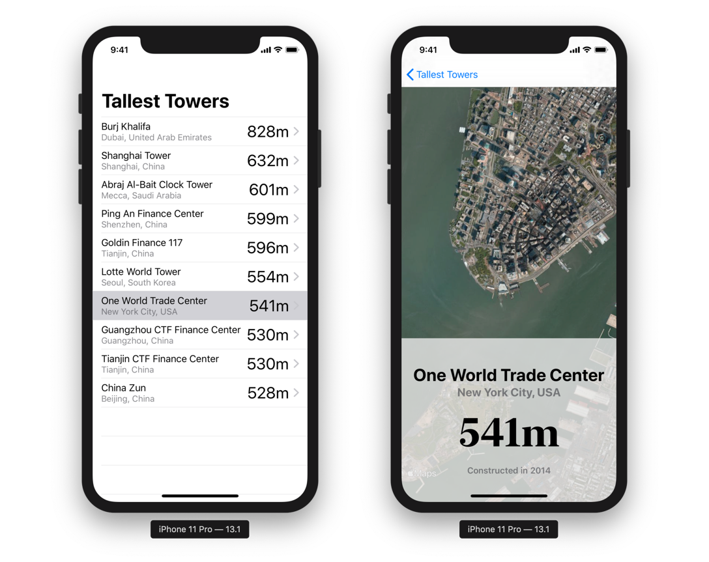
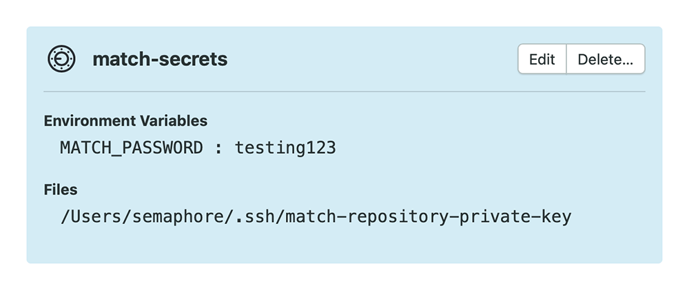
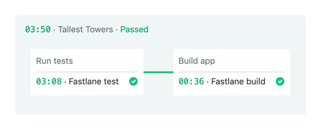

# Semaphore CI for iOS

This example iOS application includes a fully configured CI pipeline demonstrating how to build, test, and generate App Store screenshots for an iOS app with [Semaphore CI](https://semaphoreci.com). This project requires Xcode 11, and is written in Swift 5.1 using SwiftUI.

## Run the example app and tests locally

To run the example application, fork this repository and clone it locally. Open `TallestTowers.xcodeproj`, select an installed simulator and choose "Run" from the "Product" menu or press ⌘R.

This project also includes both unit, and UI tests. To run all tests locally, choose "Test" from the "Product" menu or press ⌘U.



## Set up code signing

Before you run the example app on a real device or on Semaphore, you'll need to configure code signing.

First, you'll will need to configure the Xcode project to use your development team. Open `TallestTowers.xcodeproj` and set the development team for each of the `TallestTowers`, `TallestTowersTests`, `TallestTowersUITests`, and `TallestTowersScreenshots` targets as follows:

1. Select the `TallestTowers` project in the Project navigator.
2. Switch to the "Signing & Capabilities" tab.
3. Select each target in turn and select a valid development team in the "Signing" settings.

Then, open the `Matchfile` in the `fastlane` folder and make the following edits:

1. Set the `git_url` to an empty, private git repository that can be used to store encrypted certificates and provisioning profiles for this example project.
2. Set the `username` to the email address for your Apple developer account.

Then, generate ad hoc signing certificates and provisioning profiles. Quit Xcode and run the following command in Terminal:

```shell
bundle exec fastlane match adhoc
```

Finally, open `TallestTowers.xcodeproj` with Xcode again and make the following changes:

* Select the `TallestTowers` target in the project and switch to the "Signing and Capabilities" tab.
* Uncheck the "Automatically manage signing" checkbox.
* Select `match AdHoc com.semaphoreci.TallestTowers` from the "Provisioning Profile" drop-down.

## Run the CI pipeline locally

Now that code signing is configured, you should be able to test the CI pipeline locally. An example `Fastfile` has been included in this project which is configured to:

* `build`: Build the app and archive an ad hoc IPA file.
* `test`: Build the app and run the unit and UI tests.
* `screenshots`: Build the app and generate sample App Store screenshots.

To run the CI pipeline locally, execute the following commands from the project directory in Terminal:

```shell
bundle install --path vendor/gems
bundle exec fastlane build
bundle exec fastlane test
bundle exec fastlane screenshots
```

At this point, if everything is configured correctly you should have a `TallestTowers.ipa` file in the project root and a `screenshots` directory containing sample App Store screenshots.

## Run the CI pipeline on Semaphore

Semaphore pipelines are made up of blocks executed in sequence that are configured in a `.semaphore/semaphore.yml` file in the root of your project. The [pipeline configuration for this example project](.semaphore/semaphore.yml) has been configured to run all tests, build and archive the application as an IPA file, and generate App Store Screenshots. The IPA archive and App Store screenshots will also be uploaded as [job artifacts](https://docs.semaphoreci.com/article/155-artifacts).

For more information on the full capabilities of the `semaphore.yml` configuration file, read the comments in this project's `semaphore.yml`, or [read the documentation](https://docs.semaphoreci.com/article/50-pipeline-yaml).

To run the CI for this example app yourself, add your fork of this repository as a new project from [your Semaphore dashboard](https://id.semaphoreci.com/init_auth). However, if you run the pipeline at this point it will fail. For it to pass, Semaphore needs access to the private git repository where `match` stored the encrypted certificates and provisioning profiles that you generated. To allow that, follow these steps:

1. Create a new SSH public/private key pair on your local machine with `ssh-keygen`. For more information on doing this, see [Using Private Dependencies](https://docs.semaphoreci.com/article/109-using-private-dependencies).
2. Add the public key as a deploy key to your private `match` repository. For more information, if you're using GitHub to host the repository, see [Managing Deploy Keys](https://developer.github.com/v3/guides/managing-deploy-keys/).
3. From [your Semaphore dashboard](https://id.semaphoreci.com/init_auth), select "Secrets" under "Configuration".
4. Create a new secret with the name `match-secrets`. The secret does not *need* to be named this, but this is the name used in this example project's `semaphore.yml`.
5. Under "Environment Variables", enter `MATCH_PASSWORD` as the variable name and enter the password you created when running `bundle exec fastlane match adhoc`.
6. Under "Files", enter `/Users/semaphore/.ssh/match-repository-private-key` as the path to the file that will be created on the CI server, and upload the *private* key. Again, the file path does not *need* to use this path or file name but this is the location that this example project's `semaphore.yml` is configured to expect.

Your secret should look like this:



Then, just push any change to your fork of this project and Semaphore will run the CI. You should see the pipeline run, and pass.



**Important Note:** If you receive the error message "Selected machine type is not available in this organization" after setting up this example project on Semaphore, ensure your account is on the Semaphore Pro plan. A 14 day free trial of this plan is available from your dashboard.

This example Semaphore configuration uses an `a1-standard-4` machine running macOS Mojave with [Xcode 11, fastlane and other build tools pre-installed](https://docs.semaphoreci.com/ci-cd-environment/macos-catalina-xcode-11-image/). Other, larger machine types are [available if needed](https://docs.semaphoreci.com/ci-cd-environment/machine-types/).

## License

Copyright ©2019 Rendered Text – Distributed under the MIT License. See the [LICENSE](LICENSE) for full terms.
