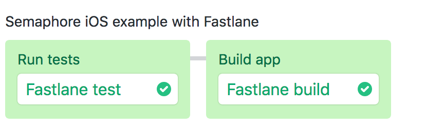

# Semaphore demo CI pipeline for iOS with Swift and Xcode

Example Swift app and CI pipeline showing how to run iOS projects on
[Semaphore](https://semaphoreci.com).

## App overview

Requirements:

- Xcode 11.1
- [Fastlane](https://fastlane.tools)

### Build the sample project locally

Before building, open `HelloWorld.xcodeproj` and set the Development team for each of the `HelloWorld`, `HelloWorldTests`, and `HelloWorldUITests` targets:

1. Select the `HelloWorld` project in the Project navigator.
2. Switch to the "Signing & Capabilities" tab.
3. Select each target in turn and select a valid development team in the "Signing" settings.

#### Building and testing with Xcode

To build the project and run the tests with Xcode locally, run the following command:

```
xcodebuild clean test -project HelloWorld.xcodeproj -scheme HelloWorld -destination "platform=iOS Simulator,OS=13.1,name=iPhone 11"
```

#### Building and testing with Fastlane

To build the project and run the tests locally with Fastlane, run the following commands:

```
bundle install --path vendor/gems
bundle exec fastlane ios test
bundle exec fastlane ios build
```

## CI pipeline on Semaphore

The Semaphore pipeline is configured to:

1. Run application test
2. Build the app with gym (which would generate an `ipa` file signed by your
   developer certificate)

A commented Semaphore pipeline configuration is located at
[.semaphore/semaphore.yml](.semaphore/semaphore.yml)



## License

Copyright (c) 2019 Rendered Text

Distributed under the MIT License. See the file LICENSE.
